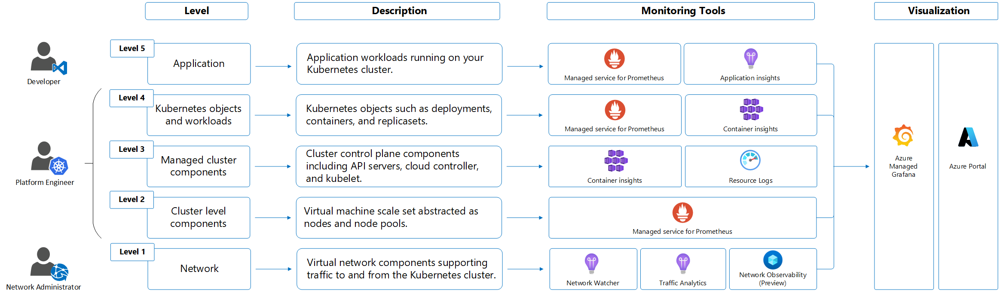

# Monitoring Azure Kubernetes Service (AKS)

In this guide, we'll cover:

- Types of monitoring data you can collect for AKS.
- Ways to analyze that data.

> **Note**: If you're already familiar with AKS or Azure Monitor and just want to learn how to analyze the data, jump to the [Analyze](#analyze) section.

When running critical applications on Azure, it's important to monitor and get alerts for your system. Azure Monitor collects metrics and logs from all parts of your system, giving you insight into its availability, performance, and health. It also notifies you when issues arise. You can use the Azure portal, PowerShell, Azure CLI, REST API, or client libraries to set up and view monitoring data.

For more details:
- [Azure Monitor Overview](https://docs.microsoft.com/en-us/azure/azure-monitor/overview)
- [Monitor Azure resources with Azure Monitor](https://docs.microsoft.com/en-us/azure/azure-monitor/overview)

## Monitoring AKS

Kubernetes is a distributed system with many moving parts, so monitoring needs to happen at multiple levels. Even though AKS is managed by Azure, you still need to apply thorough monitoring practices.

### Key resources for AKS monitoring:
- [Detailed Kubernetes stack monitoring](https://docs.microsoft.com/en-us/azure/azure-monitor/containers/container-insights-overview)
- [Azure Monitor for Prometheus](https://learn.microsoft.com/en-us/azure/azure-monitor/essentials/prometheus-overview)
- [Azure Monitor for Kubernetes logs](https://learn.microsoft.com/en-us/azure/azure-monitor/containers/container-insights-log-analytics)
- [Azure Workbooks for data visualization](https://learn.microsoft.com/en-us/azure/azure-monitor/visualizations)
- [Monitor Azure services in Grafana](https://learn.microsoft.com/en-us/azure/azure-monitor/essentials/grafana-overview)


## Monitoring Data


AKS generates the same types of monitoring data as other Azure resources. You can check the [Monitoring AKS data reference](https://learn.microsoft.com/en-us/azure/aks/monitor-aks) for details on the metrics and logs created by AKS. Other Azure services and features also collect additional data and allow for further analysis. 

## Key Sources of Monitoring Data

| Source | Description |
|--------|-------------|
| **Platform metrics** | Automatically collected for AKS clusters at no cost. Analyze using metrics explorer or set up metric alerts. |
| **Prometheus metrics** | When enabled, Azure Monitor collects Prometheus metrics and stores them in a workspace. You can view these metrics using Grafana or set up Prometheus alerts. |
| **Activity logs** | Automatically track activities like cluster creation or configuration changes. These logs can be sent to Log Analytics for deeper analysis. |
| **Resource logs** | Logs related to the control plane. You need to set up diagnostic settings to send them to Log Analytics for analysis and alerts. |
| **Container insights** | Collects logs and performance data from the cluster, including container outputs. Analyzed through Container insights or Log Analytics. |

## Understanding Resource Types

Azure uses resource types and IDs to identify everything in your subscription. Resource types help organize monitoring data. For example, a virtual machine's resource type is `Microsoft.Compute/virtualMachines`. Different resources generate different types of metrics and logs.

For more on AKS resource types, see [AKS monitoring data reference](https://learn.microsoft.com/en-us/azure/aks/monitor-aks).

## Data Storage in Azure Monitor

- **Metrics** are stored in the Azure Monitor metrics database.
- **Log data** is stored in the Azure Monitor logs store (queried using Log Analytics).
- **Activity logs** have their own storage and interface in the Azure portal.

Metrics and activity logs can also be routed to the logs store for easier querying alongside other data. You can also send this data to external storage locations like Azure Storage or third-party systems using Event Hubs.

For details on data storage, see [Azure Monitor data platform](https://learn.microsoft.com/en-us/azure/azure-monitor/platform/data-platform).

## Azure Monitor Platform Metrics

Platform metrics are automatically collected from most services and stored in a time-series database. These metrics help track performance in real-time and support alerting. 

You can route these metrics to Log Analytics for querying alongside logs. For more information, see [Metrics diagnostic settings](https://learn.microsoft.com/en-us/azure/azure-monitor/essentials/diagnostic-settings).

For a full list of available AKS metrics, check out [AKS monitoring data reference](https://learn.microsoft.com/en-us/azure/aks/monitor-aks).

### Prometheus Metrics

AKS also exposes metrics from key control plane components (e.g., API server, ETCD, Scheduler) through Azure Managed Prometheus. This feature is currently in preview. For details, see [AKS control plane metrics (preview)](https://learn.microsoft.com/en-us/azure/aks/control-plane-metrics).

## Additional Monitoring Services for AKS

You can enable extra monitoring features during AKS cluster creation, using the Azure portal, CLI, Terraform, or Azure Policy. Be mindful that these features may incur extra costs.

| Service / Feature | Description |
|-------------------|-------------|
| **Container insights** | Collects container logs and Kubernetes events. Data is stored in a Log Analytics workspace. You can enable this feature at cluster creation or later. For details, see [Enable Container insights for AKS](https://learn.microsoft.com/en-us/azure/azure-monitor/containers/container-insights-enable-aks). |
| **Azure Monitor for Prometheus** | Fully managed, Prometheus-compatible solution. It collects Kubernetes metrics and stores them in an Azure Monitor workspace linked to Grafana for analysis. For details, see [Collect Prometheus metrics from AKS](https://learn.microsoft.com/en-us/azure/azure-monitor/essentials/prometheus-overview). |
| **Azure Managed Grafana** | Fully managed Grafana for visualizing Prometheus metrics and other data. For details, see [Link a Grafana workspace](https://learn.microsoft.com/en-us/azure/azure-monitor/grafana/grafana-workspace). |

## Monitor AKS Control Plane Metrics (Preview)

The control plane metrics feature (preview) collects metrics from core components like the API server, ETCD, and Scheduler. These metrics are fully compatible with Prometheus and Grafana, giving you greater visibility into cluster performance.

**Prerequisites**:
- Azure Monitor Managed Service for Prometheus is required.
- Private link is not supported.
- Customizations are limited to the `ama-metrics-settings-config-map`.
- The AKS cluster must use managed identity authentication.

For more information, see [Monitor AKS control plane metrics (preview)](https://learn.microsoft.com/en-us/azure/aks/control-plane-metrics).


### Installing aks-preview Extension

> **Important**: AKS preview features are opt-in and provided "as is." They are not covered under service-level agreements and are not recommended for production environments. For more info, check:
- [AKS support policies](https://learn.microsoft.com/en-us/azure/aks/support-policies)
- [Azure support FAQ](https://learn.microsoft.com/en-us/azure/aks/support-faq)

### Installing or Updating aks-preview Extension

Use the following commands to install or update the `aks-preview` Azure CLI extension.

```bash
# Install the aks-preview extension
az extension add --name aks-preview

# Update the aks-preview extension
az extension update --name aks-preview


## Registering AzureMonitorMetricsControlPlanePreview Flag

To enable control plane metrics, register the feature flag using the command below:

```bash
az feature register --namespace "Microsoft.ContainerService" --name "AzureMonitorMetricsControlPlanePreview"
```

It takes a few minutes for the feature to register. Verify the status with:

```bash
az feature show --namespace "Microsoft.ContainerService" --name "AzureMonitorMetricsControlPlanePreview"
```

Once registered, refresh the provider:

```bash
az provider register --namespace "Microsoft.ContainerService"
```

## Enabling Control Plane Metrics on AKS

### For a New AKS Cluster

To enable control plane metrics for a new cluster, follow the steps in [Enable Prometheus and Grafana for AKS clusters](https://learn.microsoft.com/en-us/azure/azure-monitor/containers/container-insights-enable-prometheus).

### For an Existing AKS Cluster

If you already have the Prometheus add-on, update the cluster to collect control plane metrics:

```bash
az aks update --name $CLUSTER_NAME --resource-group $RESOURCE_GROUP
```

> **Note**: Control plane metrics are collected separately from node metrics, and it may take several minutes for the data to appear.

## Querying Control Plane Metrics

Control plane metrics are stored in an Azure Monitor workspace. You can view these metrics in the Azure portal or through Grafana.

1. Navigate to your AKS cluster in the Azure portal.
2. Under **Monitoring**, select **Insights**.

If using Grafana, import the following dashboards:
- API server
- ETCD

## Customizing Control Plane Metrics

AKS allows you to customize which metrics to collect for each component. The default setup includes metrics for the API server and ETCD. To customize:

1. Download the `ama-metrics-settings-configmap.yaml` file and rename it to `configmap-controlplane.yaml`.
2. Set `minimalingestionprofile` to `false` to collect all metrics.
3. Verify that the targets you want to scrape (e.g., API server, ETCD) are set to `true`.
4. Apply the ConfigMap:

```bash
kubectl apply -f configmap-controlplane.yaml
```

It will take several minutes for the metrics to appear in Azure Monitor.

## Troubleshooting Control Plane Metrics

### Common Issues:
1. **No Metrics Collected**: Ensure the `AzureMonitorMetricsControlPlanePreview` flag is enabled and `ama-metrics` pods are running.
2. **Missing Specific Metrics**: Sometimes metrics are documented but not available. Verify that other metrics are being collected properly.
3. **Workspace Access Issues**: Ensure you have access to the Azure Monitor workspace where the metrics are being stored.

## Disabling Control Plane Metrics

To disable control plane metrics:

1. Disable the managed Prometheus add-on:
   
```bash
az aks update --disable-azure-monitor-metrics --name $CLUSTER_NAME --resource-group $RESOURCE_GROUP
```

2. Unregister the feature flag:

```bash
az feature unregister --namespace "Microsoft.ContainerService" --name "AzureMonitorMetricsControlPlanePreview"
```

## FAQ

- **Can I scrape control plane metrics with self-hosted Prometheus?**
  - No, control plane metrics are only available through Azure Managed Prometheus.
  
- **Why isn't the user agent available in control plane metrics?**
  - The user agent is only available through control plane logs, not metrics.


### Azure Monitor Resource Logs for AKS

Resource logs in Azure provide insights into the operations performed by an Azure resource. These logs are automatically generated, but to save or query them, you need to route them to Azure Monitor logs. The logs are categorized by namespaces, and each namespace may have multiple log categories.

## Collecting and Routing Resource Logs

- **Collection**: Resource logs are not collected by default. You must create a diagnostic setting to route the logs to one or more locations (e.g., Azure Monitor Logs, Azure Storage, Event Hubs). You can create these settings via the Azure portal, CLI, PowerShell, or Azure Policy.
- **Routing**: It is recommended to route logs to Azure Monitor Logs so you can query them alongside other log data. For more details, see [Azure resource logs](https://learn.microsoft.com/en-us/azure/azure-monitor/platform/resource-logs) and [Resource log destinations](https://learn.microsoft.com/en-us/azure/azure-monitor/platform/logs-destinations).

For further details, refer to [Diagnostic settings in Azure Monitor](https://learn.microsoft.com/en-us/azure/azure-monitor/platform/diagnostic-settings).

## AKS Control Plane / Resource Logs

Control plane logs for AKS are implemented as resource logs. To collect and store these logs, you need to create a diagnostic setting and route the logs, usually to a Log Analytics workspace. This workspace also stores Container Insights data.

To create diagnostic settings, see [Create diagnostic settings](https://learn.microsoft.com/en-us/azure/azure-monitor/platform/diagnostic-settings).

> **Important**: Collecting resource logs, especially kube-audit logs, can lead to significant costs. Consider the following to reduce costs:
> - Disable kube-audit logs when not needed.
> - Enable kube-audit-admin (to exclude get and list events).
> - Use resource-specific logs configured as basic logs.

For more cost optimization strategies, refer to [Monitor Kubernetes clusters](https://learn.microsoft.com/en-us/azure/azure-monitor/containers/container-insights-cost) and [Azure Monitor cost strategies](https://learn.microsoft.com/en-us/azure/azure-monitor/essentials/cost).

### Collection Modes

AKS supports two modes for resource logs:
- **Azure Diagnostics Mode**: Sends all data to the `AzureDiagnostics` table.
- **Resource-Specific Mode**: Sends logs to dedicated tables like `AKSAudit`, `AKSAuditAdmin`, and `AKSControlPlane`.

**Resource-Specific Mode** is recommended because:
- It makes data easier to query.
- Supports configuration as basic logs for cost savings.

For more information on these modes, see [Select the collection mode](https://learn.microsoft.com/en-us/azure/azure-monitor/essentials/resource-log-collection-modes).

## Creating Diagnostic Settings via Azure CLI

To create a diagnostic setting via CLI, use the following command:

```bash
az monitor diagnostic-settings create --name AKS-Diagnostics \
  --resource /subscriptions/<subscription-id>/resourceGroups/myresourcegroup/providers/Microsoft.ContainerService/managedClusters/my-cluster \
  --logs '[{"category": "kube-audit","enabled": true}, {"category": "kube-audit-admin", "enabled": true}, {"category": "kube-apiserver", "enabled": true}, {"category": "kube-controller-manager", "enabled": true}, {"category": "kube-scheduler", "enabled": true}, {"category": "cluster-autoscaler", "enabled": true}]' \
  --workspace /subscriptions/<subscription-id>/resourceGroups/myresourcegroup/providers/Microsoft.OperationalInsights/workspaces/myworkspace \
  --export-to-resource-specific true
```

## Sample Log Queries

When querying AKS logs, if you access the **Logs** section from the AKS cluster, it will automatically limit the scope to that cluster. To include data from other clusters or Azure services, use **Logs** from the Azure Monitor menu.

### Common Log Queries:

- **Count logs for each category**:
  ```kusto
  AzureDiagnostics
  | where ResourceType == "MANAGEDCLUSTERS"
  | summarize count() by Category
  ```

- **All API server logs**:
  ```kusto
  AzureDiagnostics
  | where Category == "kube-apiserver"
  ```

- **All audit logs (Resource-Specific Mode)**:
  ```kusto
  AKSAudit
  ```

For more queries, check out the [Container Insights queries](https://learn.microsoft.com/en-us/azure/azure-monitor/containers/container-insights-log-query).

## AKS Data Plane / Container Insights Logs

Container Insights collect telemetry data from your AKS clusters, helping you monitor and troubleshoot containerized applications. You can configure cost optimization settings to control the data collected.

### Data Collection Settings

You can customize the data collection for cost optimization using Azure Monitor Data Collection Rules (DCR). This includes controlling table selection, data collection intervals, and excluding certain namespaces.

| Grouping        | Tables                           | Notes |
|-----------------|----------------------------------|-------|
| **All (Default)** | All standard Container Insights tables | Required for default visualizations |
| **Performance**   | Perf, InsightsMetrics           |       |
| **Logs and Events** | ContainerLog, KubeEvents, KubePodInventory | Recommended if using managed Prometheus |

For more info, see [Manage an Azure Monitor workspace](https://learn.microsoft.com/en-us/azure/azure-monitor/platform/logs-manage-workspace).

This version is more concise and user-friendly while retaining key details and relevant links for deeper exploration. You can use it as-is for your Markdown file. Let me know if you need further changes!


### ContainerLogV2 Schema

Azure Monitor Container Insights provides a schema for container logs called **ContainerLogV2**, which is recommended for AKS and Azure Arc-enabled Kubernetes clusters. It includes the following fields:

- **ContainerName**
- **PodName**
- **PodNamespace**

### Key Points:
- **Basic Logs Data Plan**: ContainerLogV2 is compatible with the Basic Logs data plan, which is a low-cost option for storing high-volume logs in Log Analytics. This plan is ideal for debugging and troubleshooting without impacting costs for analytics and alerts.
- **Default Schema**: When using Managed Identity Auth via ARM, Bicep, Terraform, or the Azure portal, ContainerLogV2 is the default schema.

For more details on enabling ContainerLogV2, see [Enable ContainerLogV2 schema](https://learn.microsoft.com/en-us/azure/azure-monitor/containers/container-insights-schema).

---

# Azure Activity Log

The **Azure Activity Log** tracks subscription-level events, such as resource creation or VM starts.

- **Collection**: Activity logs are automatically generated and stored for viewing in the Azure portal.
- **Routing**: You can send activity log data to Azure Monitor Logs to analyze it with other logs. You can also route it to Azure Storage, Event Hubs, or other partner systems.

For more info, see [Overview of the Azure Activity Log](https://learn.microsoft.com/en-us/azure/azure-monitor/platform/activity-logs-overview).

---

# Viewing AKS Container Logs, Events, and Metrics in Real-Time

With **Container Insights**, you can view real-time AKS container logs, events, and pod metrics to troubleshoot issues.

### Key Features:
- **Live Logs**: Access logs directly using `kubectl logs -c`.
- **Live Events**: View real-time Kubernetes events using `kubectl get events`.
- **Live Metrics**: Monitor pod metrics in real-time using `kubectl top pods`.

> **Note**: Container logs are stored in `/var/log/containers` on the AKS node. To connect to a node, see [Connect to AKS nodes](https://learn.microsoft.com/en-us/azure/aks/ssh).

For help configuring the live data feature, see [Configure live data in Container Insights](https://learn.microsoft.com/en-us/azure/azure-monitor/containers/container-insights-live-data).

### Accessing Logs, Events, and Metrics in the Azure Portal:

1. Navigate to your **AKS cluster** in the Azure portal.
2. Under **Kubernetes Resources**, select **Workloads**.
3. Choose the Deployment, Pod, or other resource and select **Live Logs** or **Live Events** to view real-time data.

To view logs from the Log Analytics workspace, select **View Logs in Log Analytics**.

For more info on querying logs and events, see [How to query logs from Container Insights](https://learn.microsoft.com/en-us/azure/azure-monitor/containers/container-insights-log-query).

---

# Viewing Real-Time Logs, Events, and Metrics

You can view live data for logs, events, and metrics on your AKS cluster using the following steps:

### Viewing Live Logs:
1. In the Azure portal, go to your **AKS cluster**.
2. Under **Monitoring**, select **Insights**.
3. Choose **Cluster**, **Nodes**, **Controllers**, or **Containers**.
4. Select the object and then choose **Live Logs**.

### Viewing Live Events:
1. In the Azure portal, go to your **AKS cluster**.
2. Under **Monitoring**, select **Insights**.
3. Choose **Cluster**, **Nodes**, **Controllers**, or **Containers**.
4. Select the object and then choose **Live Events**.

### Viewing Real-Time Metrics:
1. In the Azure portal, go to your **AKS cluster**.
2. Under **Monitoring**, select **Insights**.
3. Choose **Nodes** or **Controllers**.
4. Select the object and then choose **Live Metrics**.

For more info on viewing historical data, events, and metrics, see [Query logs from Container Insights](https://learn.microsoft.com/en-us/azure/azure-monitor/containers/container-insights-log-query).


# Analyzing Monitoring Data for AKS

There are several tools available to help you analyze monitoring data in Azure.

## Azure Monitor Tools

1. **Metrics Explorer**: A tool in the Azure portal to view and analyze metrics for your resources. 
   - [Learn more about Metrics Explorer](https://learn.microsoft.com/en-us/azure/azure-monitor/essentials/metrics-explorer).

2. **Log Analytics**: Allows you to query and analyze log data using KQL (Kusto Query Language).
   - [Get started with Log Analytics](https://learn.microsoft.com/en-us/azure/azure-monitor/log-query/get-started-portal).

3. **Activity Log**: View and search basic activity logs in the Azure portal. For deeper analysis, route data to Azure Monitor Logs.
   - [More about Activity Logs](https://learn.microsoft.com/en-us/azure/azure-monitor/platform/activity-logs-overview).

## Visualization Tools

- **Dashboards**: Combine different kinds of data into a single pane in the Azure portal.
- **Workbooks**: Customizable reports that include text, metrics, and log queries.
- **Grafana**: An open platform for operational dashboards that can include Azure Monitor data and other sources.
- **Power BI**: Provides interactive visualizations for log data from Azure Monitor.

## Azure Monitor Export Tools

You can export monitoring data to other tools using the following methods:

- **Metrics**: Use the Azure Monitor REST API to retrieve metrics data.
- **Logs**: Use the REST API or client libraries for logs, or use workspace data export.

For more information on the REST API, see [Azure Monitor REST API walkthrough](https://learn.microsoft.com/en-us/rest/api/monitor/).

## Monitoring Tab in Azure Portal

The **Monitoring** tab on your AKS cluster’s Overview page provides graphs with common metrics for your cluster. You can analyze these metrics further using the Metrics Explorer.

- You can also enable **Managed Prometheus** and **Container Insights** here if they are not already enabled.
- To access monitoring features across all AKS clusters, select **Azure Monitor** from the Azure portal homepage.

---

# Kusto Queries (KQL)

You can analyze logs in **Azure Monitor Logs** using KQL (Kusto Query Language).

- **Important**: When you select **Logs** from the AKS menu in the portal, the query scope is set to the current AKS cluster. To query across multiple services, select **Logs** from the Azure Monitor menu.

For a list of common queries, see the [Log Analytics queries interface](https://learn.microsoft.com/en-us/azure/azure-monitor/logs/log-analytics-queries).

---

# Alerts in Azure Monitor

Azure Monitor alerts notify you when specific conditions are met in your monitoring data. These alerts help you identify and address issues before they affect customers.

- **Metric Alerts**: Triggered based on metrics like CPU usage or memory.
- **Log Alerts**: Based on Log Analytics queries.
- **Activity Log Alerts**: Triggered by activity log events.
- **Recommended Alerts**: Available for services like Virtual Machines, AKS, Log Analytics workspaces, and Prometheus metrics.

For more details, see [Azure Monitor alerts](https://learn.microsoft.com/en-us/azure/azure-monitor/alerts/alerts-overview).

### Recommended Alert Rules for AKS:

| Level       | Alerts                                         |
|-------------|------------------------------------------------|
| **Cluster** | KubeCPUQuotaOvercommit, KubeMemoryQuotaOvercommit, KubeClientErrors, KubePodCrashLooping, etc. |
| **Node**    | KubeNodeUnreachable, KubeNodeReadinessFlapping |
| **Pod**     | KubePodReadyStateLow, KubePodFailedState, KubePodNotReadyByController, etc. |

For more details on alert creation, see [Create log alerts from Container Insights](https://learn.microsoft.com/en-us/azure/azure-monitor/containers/container-insights-log-query).

---

# Network Observability in AKS

Network observability helps you maintain a healthy Kubernetes cluster by analyzing network traffic. When enabled, it collects and converts metrics into Prometheus format for visualization in Grafana.

- The collected metrics are automatically sent to **Azure Monitor Managed Service for Prometheus**.
- You can use a prebuilt Grafana dashboard to visualize these metrics.

For more information, see [Network Observability setup](https://learn.microsoft.com/en-us/azure/azure-monitor/containers/container-insights-prometheus-overview).

---

# Related Resources

- [AKS Monitoring Data Reference](https://learn.microsoft.com/en-us/azure/aks/monitor-aks)
- [Monitoring Azure Resources with Azure Monitor](https://learn.microsoft.com/en-us/azure/azure-monitor/overview)


